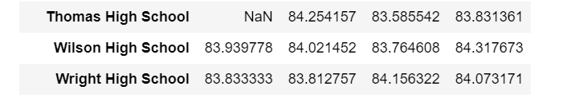

# School_District_Analysis
Python, Pandas

# Overview of the school district analysis: 
>For this project, I analyzed data from a school district. In order for the school to properly allocate expenses for schools, I had to calculate average math and reading scores per school. I was also able to compare the type of schools, size of each school and budget for each school to see what each result was so that the district can base what the next year's budget will be.
# Results: 
The school district summary was affected by removing all of the 9th grade students from Thomas High School. 

## Below is the new school district summary output:


## The school summary was affected by the average percentage of math, reading and overall scores calculated.

Here was the **old** calculations with the 9th grade Thomas High School Students:


Here is the **new** calculations without the 9th grade Thomas High School Students:


Replacing the ninth graders' math and reading scores affect school summary by changing the school's percentage. It looks like there was an increase compared to what the previous school summary was based on the comparison of the two images above.

## Replacing the ninth-grade scores affect the following:

- Math and reading scores by grade now show those scores are "NaN" in the Scores By Grade dataframe for ninth grade scores for Thomas High School:

### Math Scores By Grade:


### Reading Scores By Grade:



### Scores by school spending:


### Scores by school size:


### Scores by school type:


# Summary: 
After making all the proper calculations from the original data, I then had to remove all of Thomas High School's 9th grade scores due to academic dishonety. I was able to use the code:

```student_data_df.loc[(student_data_df["grade"] == "9th") & (student_data_df["school_name"] == "Thomas High School"),"reading_score"]=np.nan```

and

```student_data_df.loc[(student_data_df["grade"] == "9th") & (student_data_df["school_name"] == "Thomas High School"),"math_score"]=np.nan```

to remove all of the 9th grade Thomas High School scores and replaced them with a NaN (not a number).

Four major changes from the original calculations were the math score percentage, reading score percentage, overall score percentage and total number of students counted for the analysis for Thomas High School.

